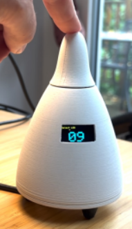

# Project Lumos

In the age of connected systems, user interfaces are getting increasingly boring and digitized. Monocolor apps with color wheels have taken away from the tactile buttons and knobs of the past. This project seeks to break those patterns, and bring back the fun in interacting with smart tech.

There is a word that this project is built around. One that my professor had mentioned early in the term. We were talking about how ubiquitous systems are built, how we use various wireless technologies to interact with our environment in a way that people never notice. He said that it all works like "Magic", and that stuck.

You can't go anywhere now without experiencing the magic; from resturant pagers, to smart HVAC systems, there are invisible data streams everywhere. To most developers, we use various apps and dashboards to visualize and analyze the streams. Within our homes, we have smart assistants like Google Home or Amazon Alexa to flip lights. If we want more detailed control, we have to open the app, and go through various menus to get to the exact items we want to change. Suddenly the magic is broken. The blinding blue light from the screen, the tapping through menus, swiping through colors, suddenly the manual labor of a switch flip has spiraled out of control.

This projects begins with a simple idea, chuck out the blue screen of death. Bring back the feel of the analog, and ubiqitous-ness of smart tech. The kinda stuff that makes you go "Wow that's like magic"

Much like the magic in the Harry Potter franchise, this project seeks to bring back that joy.

## The Boy Who Lived (Introduction)

< Describe some background of the project >

## The Sorting Hat (Conceptualization)

As Mark Twain once said: "There is no such thing as an original idea". As such, I started off by looking at our professors device:

_Professor Duncan's implementation._

In the above image, the knob at the top selects the LED Node, and by clicking the knob, a static command is sent over MQTT to the Light wall.

I began by looking at methods to expand on the functionality of this. Add color and brightness selection to the LED Node selector. One idea was a multi-stage knob. Using multiple encoders at different levels almost like a combination lock.

_Multi-stage Knob_

Internally the 2 stages would be ring gears, with a unique rotary encoder as the planetary gear to adjust specific settings. However, each additional stage added an exponential increase to the physical complexity to the device. Another idea was to put a embed a touch screen to the knob face with a gradiant selector.

_Gradient Selector_

As you might've caught on, that idea was shot down very quickly. **No touchscreens here!**

In a desperate attempt to make something unique, I began scouring the Adafruit website's sensor section looking for neat sensors I could work with. I figured finding a unique sensor would give me the niche factor I was looking for. Microphones, Strain sensors, ultrasonic, Color sensors, or gyroscopes were considered, and quickly tossed aside. Finally I came across some magnetometers, and an idea started to form.

_Magnetometer sketches and functional mapping_

By arranging 3 magnetometers in a triangle, I could wave a magnet between them, and get a whole gradient of colors. On top of that, the sensors could also measure the magnetic field in the X, Y, and Z coordinates, meaning this could be further enhanced by moving the magnet closer and further to the sensors to adjust the brightness. With the magnetometer selected, and an initial concept mapped out, I needed to figure out how all these ideas were going to come together. It wasn't enough to just change the color of a single LED Node, but I had to also select the specific node. Leaning on the knob concept from Duncan, I decided to incorporate both into a single design.

_Initial Project Sketches_

The final descision was to implement both. A knob which could select a LED Node, and a ring (described as the Portal) which holds the magnetometer array to adjust colors.

## Diagon Alley (Collecting Components)

< Purchasing items >
Breaking down the systems.
There are 2 systems, the Ring and the Knob

## The Journey from Platform Nine and Three-Quarters (Modeling and Assembly)

< Modeling and Assembly >

## Through the Trapdoor (Software and Algorithms)

< Software and Algo Overview >

## The Mirror of Erised (Reflections)

< Reflections >
